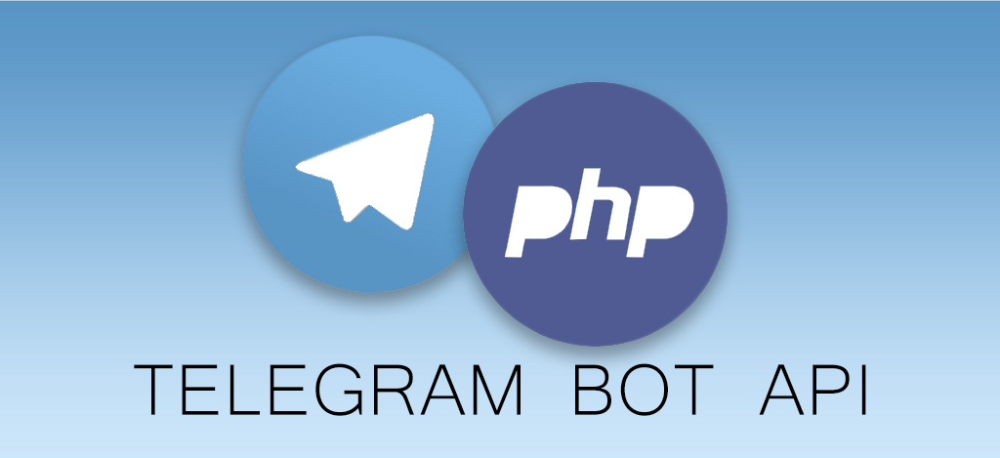

<p align="center">

</p>

# klev-o/telegram-bot-api

Simple and convenient implementation Telegram bot API with php version ^7.4 support. Based on the [Official Telegram api](https://core.telegram.org/bots/api)

[](https://github.com/klev-o/telegram-bot-api/blob/master/LICENSE)


## Intro

This bot is full support [Official Telegram api](https://core.telegram.org/bots/api). All available types and methods are described using classes with documentation of all fields. You don't even need to refer to the official documentation - all descriptions are present in the bot! But still, for each class, the url to the documentation is indicated, where you can study the nuances, etc.

**Attention!** At the moment, the bot only supports receiving updates through Webhook. Webhook is more efficient than Long-Polling, reduces server load and guarantees almost instant data refresh for your application. But it is worth considering some of the nuances, in more detail [here](https://core.telegram.org/bots/faq#im-having-problems-with-webhooks)

## Installation

Run this command in your command line:
```
composer require klev-o/telegram-bot-api
```

## Usage

### Setting up a webhook

First, you need to install Webhook, to which the telegram will send updates. This can be done using the following code:

```php
<?php

use Klev\TelegramBotApi\Telegram;
use Klev\TelegramBotApi\TelegramException;
use Klev\TelegramBotApi\Methods\SetWebhook;

require 'vendor/autoload.php';

$pageUrl = "https://".$_SERVER["SERVER_NAME"].$_SERVER["REQUEST_URI"];

try {
    $bot = new Telegram('your personal token');

    if(!file_exists("webhook.trigger")){
        $webhook = new SetWebhook($pageUrl);
        $result = $bot->setWebhook($webhook);
        if($result) {
            file_put_contents("webhook.trigger", time());
            echo 'webhook was set';
        }
    }
    
    //...
} catch (TelegramException $e) {
    // log errors
}
```

To prevent the webhook from being installed on every request, we add a simple check. Now open the file in your browser and you should see 'webhook was set'. If any error has occurred, then it can be caught in the corresponding block

### Getting Webhook Updates

To receive updates, you must use the method *getWebhookUpdates()*:
```php
<?php

use Klev\TelegramBotApi\Telegram;
use Klev\TelegramBotApi\TelegramException;
use Klev\TelegramBotApi\Methods\SetWebhook;

require 'vendor/autoload.php';

$pageUrl = "https://".$_SERVER["SERVER_NAME"].$_SERVER["REQUEST_URI"];

try {
    $bot = new Telegram('your personal token');

    if(!file_exists("webhook.trigger")){
        $webhook = new SetWebhook($pageUrl);
        $result = $bot->setWebhook($webhook);
        if($result) {
            file_put_contents("webhook.trigger", time());
            echo 'webhook was set';
        }
    }
    
    /**@var \Klev\TelegramBotApi\Types\Update $update*/
    $update = $bot->getWebhookUpdates();
} catch (TelegramException $e) {
    // log errors
}
```
The $update variable will be an object [Update](https://github.com/klev-o/telegram-bot-api/blob/master/src/Types/Update.php)


In general, by reading the official documentation, you can see the types for the fields of objects, or the return values ​​of methods - all this is completely consistent with the code.

For example, `$update->message` is of type Message, which corresponds to `Klev\TelegramBotApi\Types\Message`.

Just look at the documentation and call the methods you want!

### A real example

Let's say we want the bot to reply "Hello, *your username*" to every message to the bot.

Let's write the following code:

```php
<?php

use Klev\TelegramBotApi\Telegram;
use Klev\TelegramBotApi\TelegramException;
use Klev\TelegramBotApi\Methods\SetWebhook;
use Klev\TelegramBotApi\Methods\SendMessage;

require 'vendor/autoload.php';

$pageUrl = "https://".$_SERVER["SERVER_NAME"].$_SERVER["REQUEST_URI"];

try {
    $bot = new Telegram('your personal token');

    if(!file_exists("webhook.trigger")){
        $webhook = new SetWebhook($pageUrl);
        $result = $bot->setWebhook($webhook);
        if($result) {
            file_put_contents("webhook.trigger", time());
            echo 'webhook was set';
        }
    }
    
    /**@var \Klev\TelegramBotApi\Types\Update $update*/
    $update = $bot->getWebhookUpdates();
    
    if ($update->message) {
        $chatId = $update->message->chat->id;
        $username = $update->message->from->first_name;
        $text = "Hello, $username!";
        /**@var \Klev\TelegramBotApi\Types\Message $result*/
        $result = $bot->sendMessage(new SendMessage($chatId, $text));
    }
    
} catch (TelegramException $e) {
    // log errors
}
```

As you can see, everything is very simple and straightforward. Remember, methods have many parameters that you can further customize to your preference. Description of each parameter is present in the code in phpdoc, or on the website of the official API documentation

```php 
$chatId = $update->message->chat->id;
$username = $update->message->from->first_name;
$messageId = $update->message->id;
$text = "Hello, $username!";

$msg = new SendMessage($chatId, $text)
$msg->disable_notification = true;
$msg->reply_to_message_id = $messageId;

$bot->sendMessage($msg);
```

## Advanced


As you can see, the `$bot->getWebhookUpdates()` method returns the result as an [Update](https://github.com/klev-o/telegram-bot-api/blob/master/src/Types/Update.php) object. In the simplest case, we can check which field is filled in this object and, on this basis, implement further logic. But this may not be very convenient if we have any medium or large project.

Events come to the rescue (`Klev\TelegramBotApi\Events\*`):

| List of events            |
|---------------------------|
| `CallbackQueryEvent`      |
| `ChannelPostEvent`        |
| `ChatJoinRequestEvent`    |
| `ChatMemberEvent`         |
| `ChosenInlineResultEvent` |
| `EditedChannelPostEvent`  |
| `EditedMessageEvent`      |
| `InlineQueryEvent`        |
| `MessageEvent`            |
| `MyChatMemberEvent`       |
| `PollAnswerEvent`         |
| `PollEvent`               |
| `PreCheckoutQueryEvent`   |
| `ShippingQueryEvent`      |

You can register your own handler for any of these events and be sure which update you are responding to.
By default, events are disabled. To enable them, you need to use the method `$bot->setEnableEvents(true);` Consider an example:

```php
<?php

use Klev\TelegramBotApi\Telegram;
use Klev\TelegramBotApi\Events\EditedMessageEvent;
use Monolog\Handler\StreamHandler;
use Monolog\Logger;

require 'vendor/autoload.php';

//The logger does not have to be created, it is used only for an example
$logger = new Logger('App');
$logger->pushHandler(new StreamHandler('../var/logs/app.log'));

$bot = new Telegram('your personal token');
$bot->setEnableEvents(true);

$bot->on(EditedMessageEvent::class, static function(EditedMessageEvent $event) use ($logger)  {
    //do something with $event
    $logger->info('id from event', [$event->update_id])
    $logger->info('payload from event', [$event->payload])
});
```
Each Event object will have 2 required fields: `update_id` and `payload`. What type of payload will be in the event can be viewed in the class with the desired event

```php
//For this example, let's assume that the incoming webhook populated the message field in the object
$updates = $bot->getWebhookUpdates();

//Then the `MessageEvent` will fire and the fields will be filled accordingly:
$event->update_id  === $updates->update_id
$event->payload === $updates->message
```
Also, as an event handler, you can use anything that corresponds to the callable type. Consider an example:

```php
<?php

use Klev\TelegramBotApi\Telegram;
use Klev\TelegramBotApi\Events\MessageEvent;
use Monolog\Handler\StreamHandler;
use Monolog\Logger;

require 'vendor/autoload.php';

//imagine that you are using some DI
$builder = new DI\ContainerBuilder();

$builder->addDefinitions([
    //specify the rules on how to create an object
    LoggerInterface::class => function(\DI\Container $c) {
        $log = new Logger('App');
        $log->pushHandler(new StreamHandler('../var/logs/app.log'));
        return $log;
    },
    //specify the rules on how to create an object
    MessageReceivedListener::class => function(\DI\Container $c) {
        return new MessageReceivedListener($c->get(LoggerInterface::class));
    }
]);
$container = $builder->build();

//Instead of using an anonymous function, we can now use a custom class, into which,
//if necessary, we can pull everything we need (working with the database, sending by mail, etc.)
class MessageReceivedListener
{
    private Logger $logger;
    public function __construct(Logger $logger)
    {
        $this->logger = $logger;
    }
    public function __invoke(MessageEvent $event)
    {
        $this->log->info('Using invocable class', (array)$event->payload);
    }
}

$bot = new Telegram('your personal token');
$bot->setEnableEvents(true);

$bot->on(MessageEvent::class, $container->get(MessageReceivedListener::class));

$bot->getWebhookUpdates();
```

## Troubleshooting

Please, if you find any errors or not exactly - report this [problem page](https://github.com/klev-o/telegram-bot-api/issues)